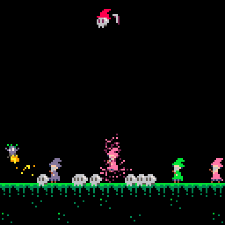

[PICO-8](https://www.lexaloffle.com/pico-8.php) is a fantasy video game console and engine. The "fantasy" part means it runs as an app on your computer and mimics a retro game console that never actually existed. It has a complete toolset for making a game but has limitations like a 128x128 display, 16-color palette, and 8,192 tokens of code.

I've always wanted to make a video game, but as a beginner I didn't know where to start. I would spend so much time picking between game engines, art styles, or genres that I never actually made anything. Since there is a limit to how complex a PICO-8 game can be, there is less opportunity to get bogged down thinking about the end result. Instead of feeling unsatisfied with a wizard sprite made using Photoshop, I am excited I could use PICO-8's 8x8 editor to make a sprite that even resembles a wizard.
# Homunculus Run
This is my first PICO-8 project. My favorite part of this project was tweaking the particle system to create a convincing fire effect. You can play it [here](https://www.lexaloffle.com/bbs/?pid=187946#p).

    

<!-- <iframe class="pico-embed" src="https://www.lexaloffle.com/bbs/widget.php?pid=homunculus_run" allowfullscreen style="border:none; overflow:hidden"></iframe> -->
